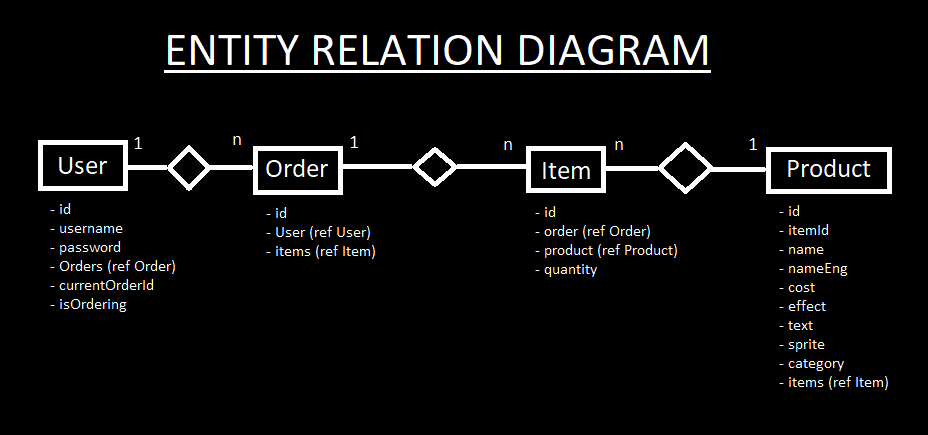
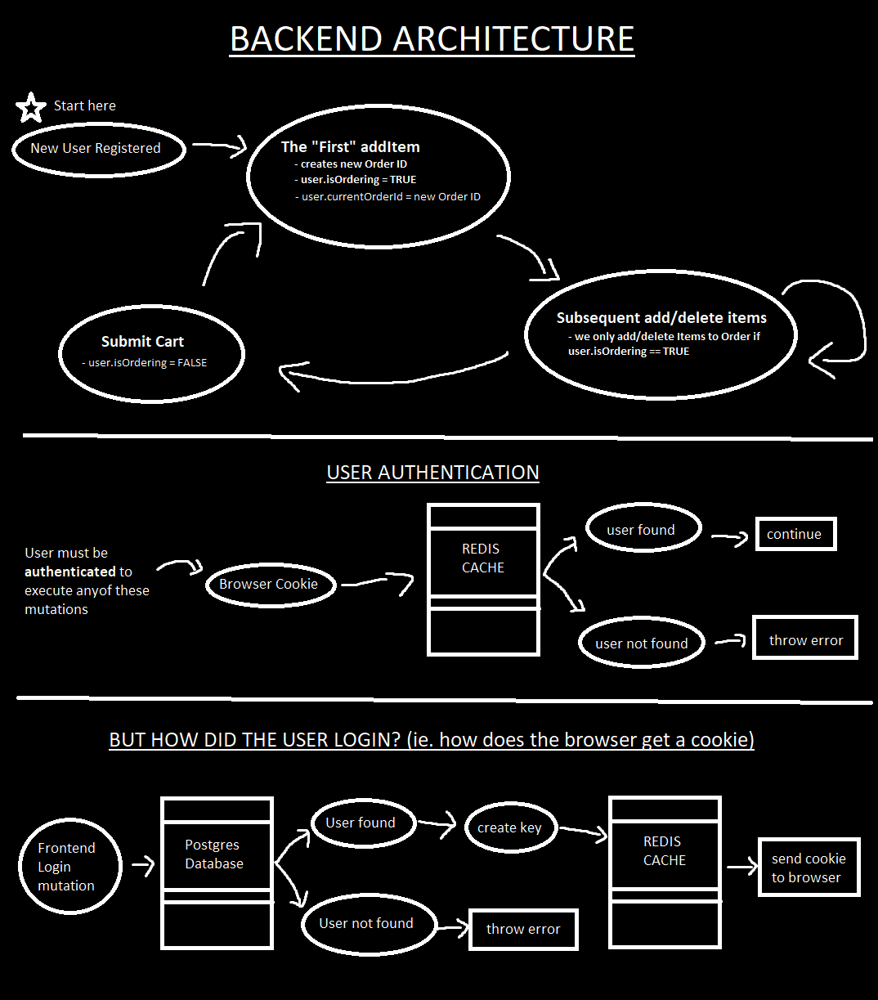

## pokemart

Backend for [pokeweb](https://github.com/ansxnlee/pokeweb), for an E-commerce web app.

## Technologies used

[Apollo](https://github.com/apollographql/apollo-server/tree/main/packages/apollo-server-express) is used with [Express](https://github.com/expressjs/express) for the API which listens for requests from the graphql client in the frontend. Graphql resolvers and entities are made with [type-graphql](https://github.com/MichalLytek/type-graphql).

[Mikro-orm](https://github.com/mikro-orm/mikro-orm) is used to generate the SQL for the database. Configuring mikro-orm.config.ts will be necessary to properly link the backend to one. 

User passwords are hashed with [argon2](https://github.com/ranisalt/node-argon2) before being stored in the database.

[express-session](https://github.com/expressjs/session) is used for user authentication by sending and recieving cookies from a web client.

[connect-redis](https://github.com/tj/connect-redis) is express middleware which is used for storing cookies for user authentication. You need redis installed on your machine for this to work properly.

## Showcase

Some diagrams I made in ms paint showing how I designed the backend.





## Additional development setup

- postgresql or another mikro-orm supported database needs to be installed with 'mikro-orm-config.ts' configured
- redis also needs to be installed for the backend to work

## Importing PRODUCTS.json into postgres

There's probably a better way to do this but this works fine I guess.

1. Copy json file into /tmp folder since /home might have restricted access with psql
2. Set psql variable name to json data (we can echo to double check the value)

```sql
\set $var `cat /tmp/PRODUCTS.json`
\echo :$var
```

3. Create a temp table that holds our entire json array in a single row

```sql
CREATE temp TABLE $tableName ( $colName jsonb );
INSERT INTO $tableName VALUES (:'$var');
```

4. Split json array into table with proper columns for ease of use
```sql
CREATE temp TABLE t1 AS 
select * from jsonb_to_recordset((select * from t)) 
AS x(cost int, name text, text text, effect text, "itemId" int, sprite text, "nameEng" text, category text);
```

5. Copy our table from step 4 directly into the "product" table
```sql
INSERT INTO product (item_id, name, name_eng, cost, effect, text, sprite, category, created, updated) 
SELECT "itemId", name, "nameEng", cost, effect, text, sprite, category, CURRENT_DATE, CURRENT_DATE FROM t1;
```

## Areas for improvement

- need to explicitly define sessions object types instead of my hacky workaround
